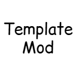

# multiloader

**A personal Gradle template for developing one Minecraft mod on Fabric and NeoForge.**

Shared code is compiled independently in `common`, including a physically separated shared client source set.

---

## Source

This repository is derived from [Jaredlll08's MultiLoader Template](https://github.com/jaredlll08/MultiLoader-Template) and maintained independently.

It is not an official Fabric, NeoForge, or upstream MultiLoader project.

## Projects

| Project | Purpose |
|---|---|
| `build-logic` | Shared Gradle conventions and common source/resource wiring |
| `common` | Loader-independent main and client code |
| `fabric` | Fabric entrypoints, APIs, metadata, data generation, and split main/client source sets |
| `neoforge` | NeoForge entrypoints, configuration, metadata generation, data generation, and runs |

## Source Boundaries

```text
common/src/main      Shared code that is safe on both physical sides
common/src/client    Shared client-only Minecraft code
fabric/src/main      Fabric common-side integration
fabric/src/client    Fabric client entrypoints and integration
neoforge/src/main    NeoForge integration, with client loading controlled by Dist-aware entrypoints
```

`common/src/main` must not reference client-only Minecraft classes.
`common/src/client` may reference `net.minecraft.client`, but must not reference Fabric or NeoForge APIs.
Its source set is the environment boundary, so shared client classes should not use Fabric `@Environment` or NeoForge `@OnlyIn` annotations.

Fabric compiles shared client code through Loom's client source set.
NeoForge compiles the same shared implementation into its universal mod and controls initialization through client-only entrypoints or events.

## Starting a Mod

1. Set the project name in `settings.gradle` and update the active toolchain, loader versions, mod metadata, and compatibility ranges in `gradle.properties`.
2. Refactor `io.github.simonxwei.template` to the new Java package and rename the template Java types.
3. Keep `TemplateConstants.MOD_ID` and `MOD_NAME` synchronized with `mod_id` and `mod_name`.
4. Rename both `META-INF/services` files and update the provider class written inside each file.
5. Rename the five Mixin configuration files and the Fabric class-tweaker file from `template` to the final mod ID.
6. Delete or regenerate stale files under `neoforge/src/generated/resources`, reload Gradle, and test both loaders.

Use IDEA refactoring for Java packages, declarations, imports, and class names.
Changing `mod_package` only changes processed resource text; it does not refactor Java source files or ServiceLoader descriptors.

### Finalize Stable Resource Paths

The template initially uses placeholders such as `${mod_id}` and `${mod_package}` so it can be configured from `gradle.properties` and build before customization is complete.
They are valid at build time, but IDEA cannot always resolve placeholder-based Mixin configuration paths or package names.
That can weaken navigation and quick-fixes that add a Mixin class to a configuration.

After choosing the final mod ID and Java package, it is recommended to replace **stable identity paths** with their concrete values:

- Mixin configuration filenames referenced by `fabric.mod.json` and `neoforge.mods.toml`
- the Fabric class-tweaker path
- Fabric entrypoint class names
- each Mixin JSON `package` value
- stable mod IDs used in metadata table names

Keep **release metadata** parameterized where convenient, including versions, display text, authors, URLs, licenses, and compatibility ranges.
Hardcoding stable paths is an IDEA usability recommendation, not a runtime requirement.

## Mixins and Access Changes

Mixin configurations are separated by responsibility:

```text
common/src/main/resources/template.mixins.json
common/src/client/resources/template.client.mixins.json
fabric/src/main/resources/template.fabric.mixins.json
fabric/src/client/resources/template.fabric.client.mixins.json
neoforge/src/main/resources/template.neoforge.mixins.json
```

Shared access changes are maintained in both loader formats:

```text
common/src/main/resources/template.classtweaker
common/src/main/resources/META-INF/accesstransformer.cfg
```

When common code depends on an access change, keep the Fabric class tweaker and NeoForge Access Transformer semantically equivalent.
Validate the Fabric file with:

```shell
./gradlew :fabric:validateAccessWidener
```

## Build and Test

```shell
./gradlew clean build
./gradlew :fabric:runClient
./gradlew :neoforge:runClient
./gradlew :fabric:runServer
./gradlew :neoforge:runServer
```

`runClient` opens a game window.
`runServer` starts a console-only dedicated server; wait for the `Done` message and enter `stop` for a clean shutdown.
A client run does not replace dedicated-server testing because an integrated single-player server still runs inside a physical client process.

Build outputs are written under each project's `build/libs` directory.
The `common` publication contains only `common/src/main`.
Shared client classes and their sources are included in the Fabric and NeoForge outputs.

## Publish

```shell
./gradlew publishToMavenLocal
./gradlew publish
```

The root commands publish `common`, `fabric`, and `neoforge` together.
`publishToMavenLocal` is useful as a publication smoke test.
By default, `publish` writes to the root `repo/` directory; set `local_maven_url` to redirect it.

## Releases

This template repository's release workflow is documented in [`RELEASING.md`](RELEASING.md).
Projects created from the template should adopt, modify, or replace that policy to match their own maintenance plan.
The documentation is version-neutral; the active Minecraft target is defined by `gradle.properties` on the current branch.

## License

This template is released under [CC0 1.0 Universal](https://creativecommons.org/publicdomain/zero/1.0/).
See [`LICENSE`](LICENSE).
